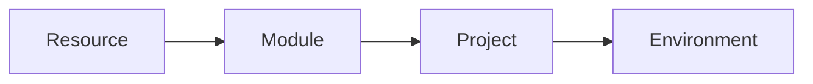
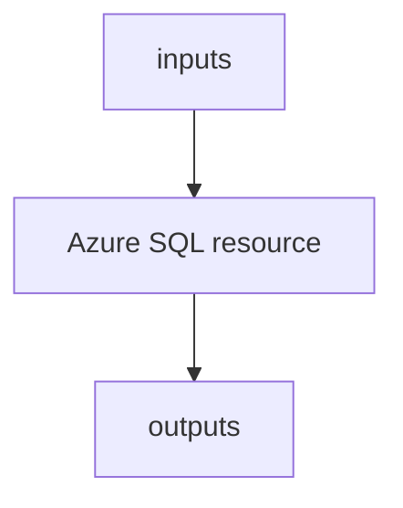
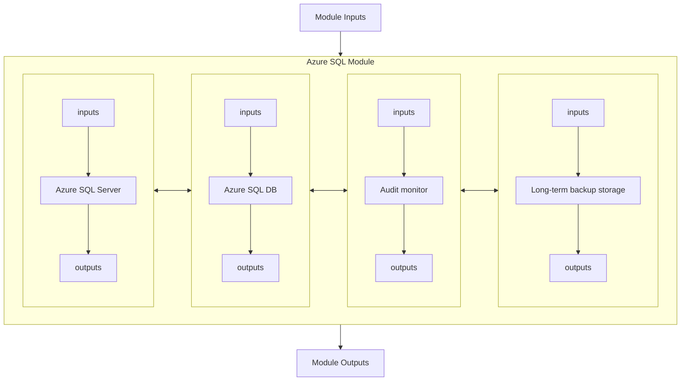
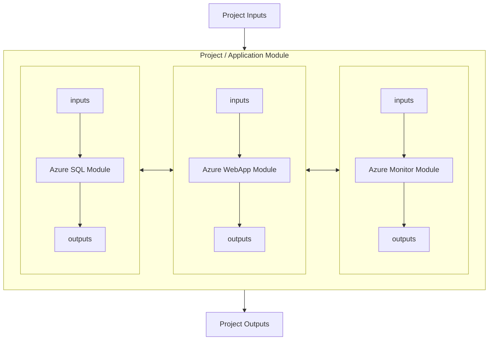
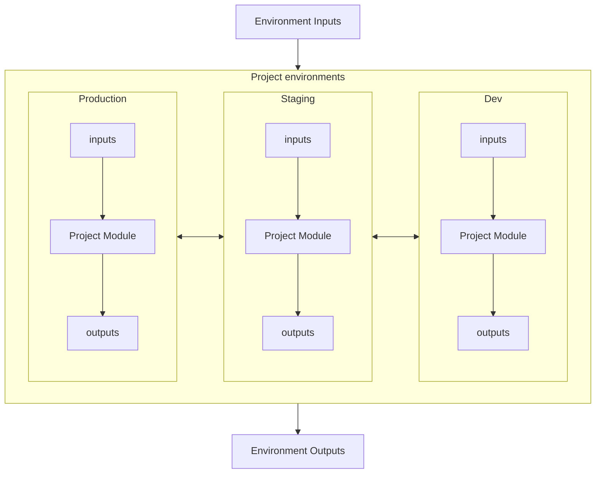

# Abstractions and interfaces

Solution should follow **Do Not Repeat Yourself** (DRY) principle. Therefore there should be multiple levels of hierarchical abstractions that captures from company-wide to project-wide best practices and knowledge. In other words avoid copy & paste as much as possible.

- Create reusable modules to deploy standard components with company-preferred configurations and smart defaults for easy start of each team
- Build projects using reusable version-controlled modules in a way that is reusable in different environments
- Instantiate projects in specific environments providing unique set of inputs



## Individual resource



## Higher-level abstraction (Module)
Solution component that is reusable and curated for company needs:
- One or more resources (eg. NIC+DISK+VM)
- **Best practices** baked in (decisions about certain features already made, eg. always secure)
- **Abstracted** (eg. single flag to do smart behavior like enable_audit or enable_ha)
- Smart **defaults** (easy to start with)
- **Reusable** across projects and environments
- Target is to **support majority of cases, but not all** (when everything is mandatory parameter, there is no abstraction and module does not provide value)



## Unit of deployment
Resources and modules used together to create **specific solution for project/application**.
- Using reusable company-wide modules as building blocks
- Project specific topology and decisions
- Project inputs to allow customization between environments (project instances)



## Environment
Actual **instance of project/application** representing specific environment or regional instance.

How to achieve this?
- Single code version for all environments, change just inputs
  - In theory looks great
  - Might fail, because at some point you might need to change code safely or add exotic exceptions before you port it to all environments (eg. lock module versions)
- Copy and paste projects code and change inputs
  - Allows for evolution and customizations
  - Not DRY, can be hard to maintain changes if you have a lot of environments
- Use tools to "copy" and maintain code between environments
  - Terragrunt tools - not part of standard Terraform approach, but nice and clean
  - Git-based solutions such as GitFlow branching - becomes very complex and hard to maintain especially for non-dev teams
- Make this module itself and provide inheritance
  - DRY and clean
  - Harder to understand some tools do not provide visibility for nested modules



# Interfaces
Provide smart defaults - I should be able to set things up using as little knowledge as possible to gain some experience and end up with something reasonable. Eg. Azure SQL instance with full features, but low price SKU.

```hcl
variable "sql_database_sku" {
  type        = string
  default     = "S0"   # Smart default
  description = <<EOF
SKU string of SQL database, defaults to S0.
EOF
}
```

When introducing new variables (when you move hardcoded thing to variable) provide defaults so users of current version do not have to change code.

Introduce abstractions, eg/ provide simple switches to change complex behavior.

```hcl
variable "enable_private_endpoint" {
  type        = bool
  default     = false
  description = <<EOF
Whether to enable private endpoint for the SQL Server.
EOF
}

resource "azurerm_private_endpoint" "main" {
  count               = var.enable_private_endpoint ? 1 : 0   # Only deploy this resource if switch is on
  name                = "sql-endpoint"
  resource_group_name = var.resource_group_name
  location            = var.location
  subnet_id           = var.subnet_id

  private_service_connection {
    name                           = azurerm_mssql_server.main.name
    private_connection_resource_id = azurerm_mssql_server.main.id
    subresource_names              = ["sqlServer"]
    is_manual_connection           = false
  }

  private_dns_zone_group {
    name                 = azurerm_mssql_server.main.name
    private_dns_zone_ids = [var.private_dns_zone_id]
  }
}
```

Sometimes list of variables (inputs) can be very long and hard to understand. Consider grouping them into objects, but make sure to provide schema to avoid difficult to catch errors.
    
```hcl
variable "databases" {
  type = map(object({  # Schema
    db_name                 = string
    sku                     = string
    enable_private_endpoint = bool
  }))
```

# Modules
Use version control in GitHub for modules, do not reference local folders (one exception is unit testing the module itself).

```hcl

module "sql" {
  source                  = "github.com/tkubica12/terraform-principles//abstractions_and_interfaces/modules/azuresql?ref=azuresql-v1.0.0"
  sql_server_prefix       = "tfabstractions"
  location                = azurerm_resource_group.main.location
  resource_group_name     = azurerm_resource_group.main.name
  key_vault_id            = azurerm_key_vault.main.id
  sql_database_name       = "mydb"
  enable_private_endpoint = true
  subnet_id               = azurerm_subnet.main.id
  private_dns_zone_id     = azurerm_private_dns_zone.sql.id

  depends_on = [azurerm_role_assignment.key_vault]
}
```