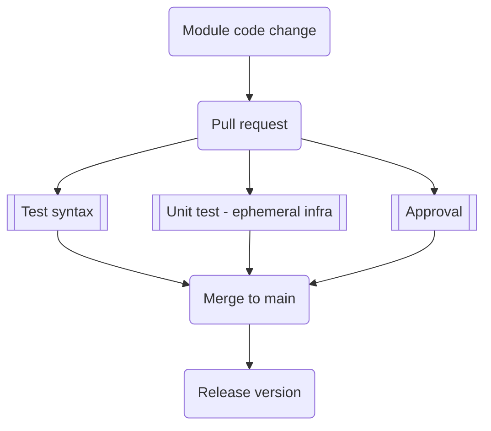
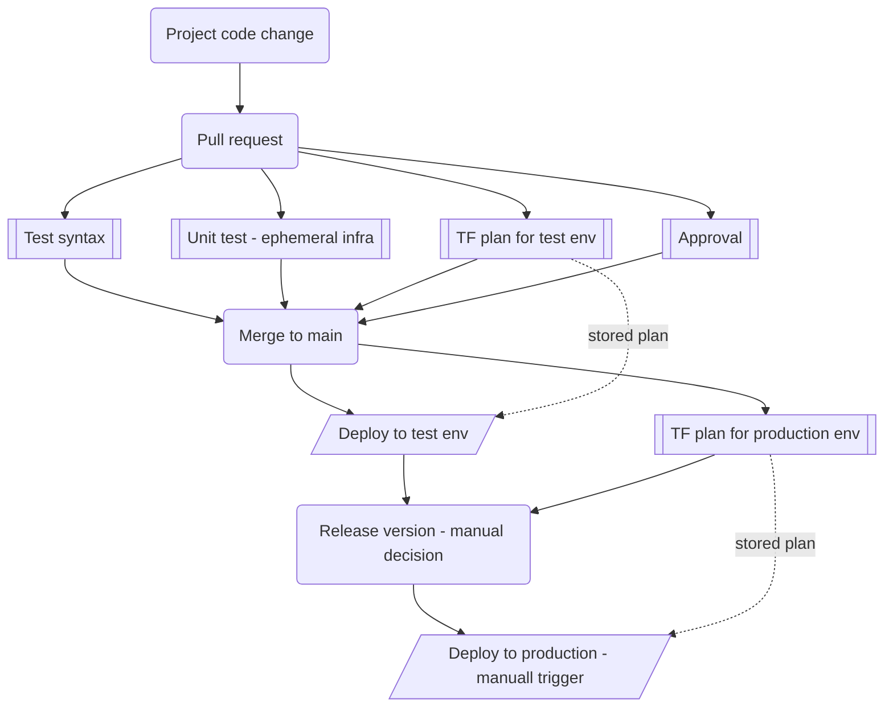

# GitOps processes
- No work without reason - always create work item (eg. GitHub Issue) and associate proposed changes with it
- Propose changes using Pull Requests against main branch so your diff is clear
- Run automated tests as part of PRs and merge to validate syntax, ensure deployability (eg. try to deploy in ephemeral manner), gather change plan (diff against real infrastructure), run smoke tests (deploy and validate results), check security policies (ensure security parameters configurations)
- During approval of Pull Request always see planed changes to real infrastructure and store it so only truly approved changes get executed
- Consider trunk-based deployment (prod/staging only) when after merge to main branch, staging evn gets deployed automatically and change plan is stored against production (for potential approval to enroll to production)
- All modules and projects should have semantic versioning - use Git tags (eg. GitHub Release) so users can pin to specific versions and get information about changes.
- There are multiple strategies for repos - you can use single repo for every module and project (easier and clear versioning, streamlined CI/CD), single repo for everything (easier to download and contribute to) or mix (eg. one separate repo for all companuy modules and then repo for each project).
- Reference modules and projects via Git repo a tag, do not copy and paste content.

## Module change flow
Here is flow in GitHub Actions to manage changes is module code.

## Project change flow
Here is flow in GitHub Actions to manage changes is projects.

